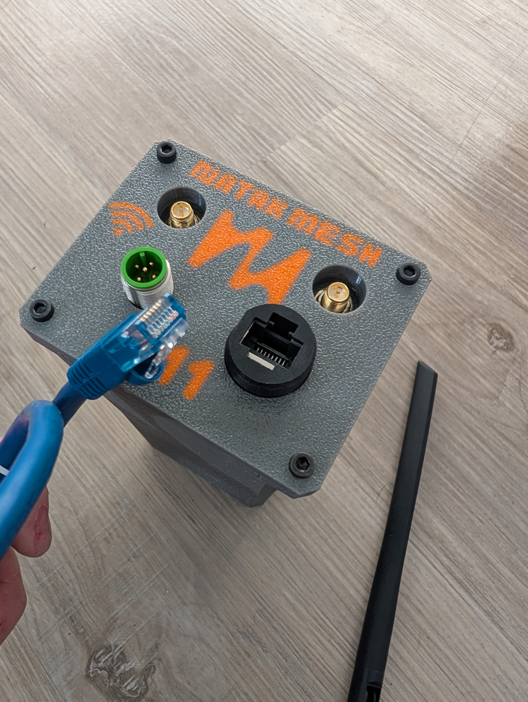
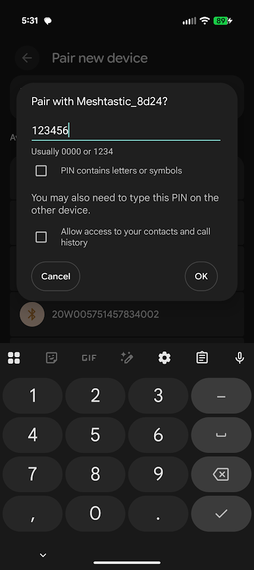

## Contents

Each Nucleus V1 comes with the node itself, antennas for the Wi-Fi and LoRa radios, a USB to M12 power cable and an short ethernet cable.

 <em>Fig.1: Contents of Nucleus order</em>

## Assembly

The Wi-Fi antenna port is marked with the standard wifi symbol. The antenna itself will be marked as a Wi-Fi antenna. The LoRa antenna will be installed on the remaining RF connector.

 <em>Fig.2: Wi-Fi antenna and RF connector</em>

 <em>Fig.3: LoRa antenna and RF connector</em>

&nbsp;

The antennas are recessed into the upper cap of the Nucleus. Note that the knurled section at the very bottom of the antenna is the section that must be rotated to thread the antenna on the connector. There is a joint that allows the antenna to rotate freely even when threaded on. The knurled section may be tough to rotate as the antenna threads down, but this must be done to ensure a good connection. The arrow in Fig.4 indicates the knurled section of the antenna

 <em>Fig.4: Turn indicated knurled section to tighten antenna to connector</em>

## Cabling

The Nucleus receives power via the M12 port. This is an A-coded M12 connection that can only be installed in a single orientation. The other end of the cable is standard USB A, allowing the Nucleus to use any 5V USB port as power. The remaining port is a standard RJ-45 connection. Note this connection is NOT waterproof without the provided cap installed.

 <em>Fig.5: M12 power connector</em>

 <em>Fig.6: Available RJ45 connection</em>

## Start Up

Ensure antennas are installed before applying power to avoid potential damage to the radios. Connect M12 power cable to the Nucleus and plug the USB connection into something like a USB power bank or USB wall charger. This will start the Nucleus and it will begin its auto boot procedure. The standard networking module along with Wi-Fi access point and Meshtastic radio should be available within 1-2 minutes.

 <em>Fig.7: Nucleus node powered up</em>

## Connections

After 1-2 minutes the Nucleus will have set up an access point that can be connected to just like any other Wi-Fi access point. Search for Wi-Fi networks, it will be labeled as 'Nucleus_xxx" where xxx is the serial number printed into the top cap of the node. In this case, serial number 11. The default password is 52235223, this can be changed in /etc/hostapd/hostapd.conf along with the AP channel and name.

&nbsp;

 <em>Fig.8: Nucleus broadcasting AP</em>

&nbsp;

At this point the Meshtastic radio should be powered up and will be broadcasting its pairing request. The ID of the Meshtastic node associated with your Nucleus will be included in the spreadsheet emailed to you. Pair with this like a standard Meshtastic node, use the official Meshtastic application to interface with it. The default pairing password for the Meshtastic node is 123456.

&nbsp;

 <em>Fig.9: Pairing to Meshtastic node</em>

## Communicate

After all nodes have been booted they will have established a Wi-Fi and a LoRa mesh via the external Wi-Fi card and Meshtastic board. At this point there are many ways to communicate. Boot up ATAK on a connected EUD, the Nucleus mesh will automatically allow communication between each ATAK instance connected to the Wi-Fi Mesh. Add the official Meshtastic ATAK plugin to allow your EUD to take advantage of the Meshtastic radio for ATAK data in parallel to the high speed Wi-Fi mesh.

The Meshtastic node can act independently via the Meshtastic application. This will operate just like any Meshtastic node on the market.

Use the provided RJ45 port to connect a Nucleus node into a Starlink antenna to provide internet access to the entire Wi-Fi mesh. Set up the onboard Tailscale instance to allow your Nucleus network VPN access to online resources.

Use the onboard Reticulum and Nomadnet instances as another method to leverage the Wi-Fi mesh and internet connection via pre-configured interfaces to communicate locally or securely and anonymously over the internet.

If TAKserver is enabled on a node (or all the nodes) use the provided SSL certs to bring devices onto the server allowing for data sync, video streaming, server federation, etc.

There are more options than I can put into a single document. The idea behind the Nucleus is to provide the hardware and software to allow many methods and routes of communication as we can reasonably provide.

This project is by no means done and development and improvements will be coming continuously.

 <em>Fig.10: Small Nucleus Mesh. 2 nodes running ATAK with a 3rd node TAKserver being accessed via laptop</em>

 <em>Fig.11: Official Meshtastic application interfacing with onboard Meshtastic radio</em>

 <em>Fig.12: ATAK EUD connected via Wi-Fi to Nucleus</em>

