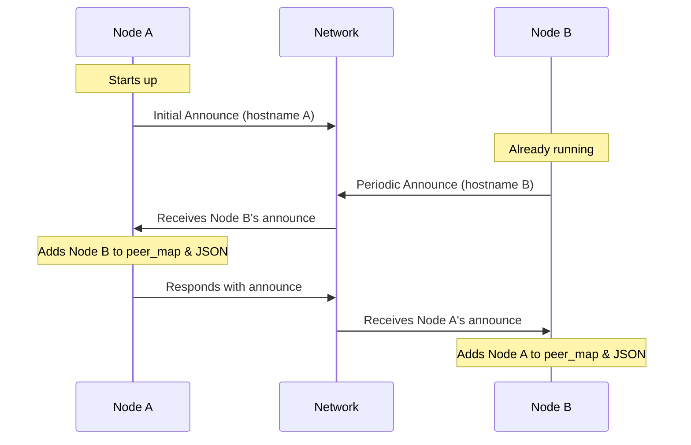

# PeerDiscovery Module

## Overview

The PeerDiscovery module is responsible for announcing our presence on the Reticulum network, tracking peers, and maintaining mappings between identities and hostnames. It operates independently of specific transport mediums (such as WiFi or LoRa) and provides a synchronized JSON state file for other modules to access peer information. The module is designed to be simple, resilient, and to ensure bi-directional peer discovery in the mesh network.

## Core Functionality

### 1. Identity and Destination Management
- Creates this node's identity and "IN" destination internally on initialization
- The "IN" destination is created with:
  - RNS.Destination.IN direction (for receiving)
  - RNS.Destination.SINGLE type (for encrypted communication)
  - APP_NAME and ASPECT from config
- This destination is what other nodes will use to communicate with us
- The destination is announced periodically to let other nodes know how to reach us
- Sets automatic proof strategy (RNS.Destination.PROVE_ALL) to validate all received packets

### 2. Startup and Cleanup
- Performs a complete cleanup of peer data on startup
- Creates a fresh peer_discovery.json file with empty peers
- Ensures no stale peer information persists between restarts
- Resets all internal tracking variables
- Implements a STARTUP_DELAY (default: 10 seconds) to allow LoRa radio initialization

### 3. Configuration and Filtering
- Uses config.py (located at `{BASE_DIR}/tak_transmission/reticulum_module/new_implementation/config.py`) for key settings:
  - APP_NAME and ASPECT for filtering announces (e.g., "atak.cot")
  - ANNOUNCE_INTERVAL for periodic announces (60 seconds)
  - PEER_TIMEOUT for stale peer removal (300 seconds)
  - BASE_DIR for file paths
  - STARTUP_DELAY for LoRa radio initialization (10 seconds)
- Aspect filtering ensures only relevant peers are discovered
- Only processes announces matching "{APP_NAME}.{ASPECT}"
- Nodes must share the same APP_NAME and ASPECT to be discovered as peers

### 4. Announce Management
- Broadcasts our presence on the network
- Processes announces from other peers
- Uses responsive announces to quickly form mesh connections
- A daemon thread runs in the background to periodically send announces every ANNOUNCE_INTERVAL seconds
- Skips processing of our own announces to prevent loops

### Critical Implementation Detail: Destination Hashes

**IMPORTANT**: The destination hash stored in peer_discovery.json MUST be the one received directly from Reticulum announces. Never try to derive it from the public key, as this will break routing. A destination hash in Reticulum includes aspects, destination type, and other characteristics - it is not just a hash of the public key.

This was a critical bug discovered in earlier versions where deriving the hash from public key prevented path discovery. Always use the destination_hash parameter provided to the received_announce() method.

### 5. State Management
- In-memory state:
  - `peer_map`: Maps hostnames to peer data including identity and destination_hash
  - `last_seen`: Tracks when each peer was last seen
- JSON state file (peer_discovery.json):
  - Created fresh on startup via cleanup_on_startup()
  - Updated whenever peers are added/updated
  - Updated when stale peers are removed
  - Contains destination hashes needed for link establishment
  - Never includes this node, only peers
  - Format:
    ```json
    {
      "timestamp": 1234567890,
      "peers": {
        "hostname": {
          "destination_hash": "ab12cd34...",
          "last_seen": 1234567890
        }
      }
    }
    ```
- File is stored at `{config.BASE_DIR}/tak_transmission/reticulum_module/new_implementation/peer_discovery.json`
  - Note: While config.py defines PEER_STATUS_PATH, the actual implementation uses the path constructed as shown above

### 6. Peer Maintenance
- Tracks the "last seen" timestamp for each peer
- Removes stale peers that haven't been seen for PEER_TIMEOUT seconds
- Uses hostname as the primary identifier for peers
- Handles peer reboots by updating destination hashes
- Maintains both in-memory and JSON state when peers are removed

## Link Establishment Support

PeerDiscovery creates and announces this node's "IN" destination that other nodes will use to communicate with us. Other modules that want to establish outgoing links to peers need to:

1. Get the target peer's destination_hash from peer_discovery.json
2. Use RNS.Identity.recall(destination_hash) to get their Identity
3. Create an "OUT" destination to that peer using their Identity
4. Use that "OUT" destination to create a Link

This separation allows other modules to establish outgoing links without needing direct access to the peer discovery internals, while PeerDiscovery handles our node's incoming connectivity through its "IN" destination.

## Independence from WiFi/OGM

The PeerDiscovery module is completely independent of WiFi status and does not rely on OGM monitoring. All peer discovery happens through Reticulum's announce mechanism. This makes it fully transport-agnostic.

## Peer Discovery Process



## Responsive Announce Mechanism

To enable quick mesh formation, the module implements a responsive announce system:
1. When a new peer announce is received, it's immediately identified as new
2. A responsive announce is scheduled with a small random delay (0.5-1.5 seconds)
3. This ensures rapid bidirectional discovery without causing announce storms

## Key Methods

### PeerDiscovery Class
- `__init__()`: Initialize discovery module, create identity and "IN" destination
- `announce_loop()`: Periodically announce our presence
- `announce_presence()`: Send announce on the network
- `add_peer(hostname, identity, destination_hash)`: Add a new peer
- `get_peer_identity(hostname)`: Get a peer's identity
- `clean_stale_peers()`: Remove peers not seen recently
- `update_peer_status_file()`: Synchronize JSON state file
- `cleanup_on_startup()`: Reset all peer data when starting up
- `shutdown()`: Properly shut down the announce thread

### AnnounceHandler Class
- `__init__(aspect_filter, parent)`: Initialize announce handler
- `received_announce(destination_hash, announced_identity, app_data)`: Process incoming announces

## Logging Implementation

- Uses the dedicated logger module for consistent log formatting
- Creates a logger instance with name "PeerDiscovery" for the main module
- Creates a logger instance with name "AnnounceHandler" for the announce handler
- Logs are written to "peer_discovery.log"
- Provides comprehensive logging at various levels:
  - INFO: Peer additions, updates, and removals
  - DEBUG: Announce sending and receiving
  - ERROR: Error conditions during announce processing or file operations
- Log format follows the standard defined in config.py

## Safety Features

- Nodes don't add themselves to their peer maps or JSON
- Random delays on responses prevent announcement storms
- Error handling for malformed announcements
- Thread-safe operations for concurrent announce handling
- Proper shutdown mechanism to deregister the announce handler
- Fresh JSON state file on every boot via cleanup_on_startup()
- No state persistence between restarts
- Comprehensive logging via dedicated logger module
- Hostname validation before processing
- Announce thread runs as daemon to ensure clean program exit
