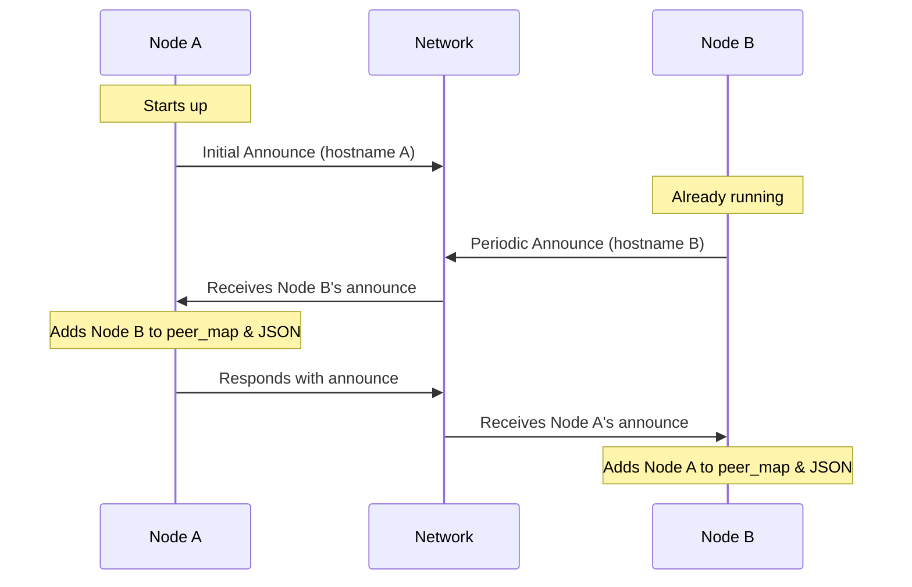

# PeerDiscovery Module

## Overview

The PeerDiscovery module is responsible for announcing our presence on the Reticulum network, tracking peers, and maintaining mappings between identities and hostnames. It operates independently of specific transport mediums (such as WiFi or LoRa) and provides a synchronized JSON state file for other modules to access peer information.

## Core Functionality

### 1. Configuration and Filtering
- Uses config.py for key settings:
  - APP_NAME and ASPECT for filtering announces (e.g., "atak.cot")
  - ANNOUNCE_INTERVAL for periodic announces (60 seconds)
  - PEER_TIMEOUT for stale peer removal (300 seconds)
  - BASE_DIR for file paths
- Aspect filtering ensures only relevant peers are discovered
- Only processes announces matching "{APP_NAME}.{ASPECT}"
- Nodes must share the same APP_NAME and ASPECT to be discovered as peers

### 2. Announce Management
- Broadcasts our presence on the network
- Processes announces from other peers
- Uses responsive announces to quickly form mesh connections
- A thread runs in the background to periodically send announces every ANNOUNCE_INTERVAL seconds
- Skips processing of our own announces to prevent loops

### 3. State Management
- In-memory state:
  - `peer_map`: Maps hostnames to RNS.Identity objects
  - `identity_to_hostname`: Maps identity hash strings to hostnames
  - `last_seen`: Tracks when each peer was last seen
- JSON state file (peer_discovery.json):
  - Created fresh on startup
  - Updated whenever peers are added/updated
  - Updated when stale peers are removed
  - Contains destination hashes needed for link establishment
  - Never includes this node, only peers
  - Format:
    ```json
    {
      "timestamp": 1234567890,
      "peers": {
        "hostname": {
          "destination_hash": "ab12cd34...",
          "last_seen": 1234567890
        }
      }
    }
    ```

### 4. Peer Maintenance
- Tracks the "last seen" timestamp for each peer
- Removes stale peers that haven't been seen for PEER_TIMEOUT seconds
- Uses hostname as the primary identifier for peers
- Handles peer reboots by updating destination hashes
- Maintains both in-memory and JSON state when peers are removed

## Link Establishment Support

The module maintains destination hashes that other modules need for establishing links:
1. Get destination_hash from peer_discovery.json
2. Use RNS.Identity.recall(destination_hash) to get the Identity
3. Use Identity + APP_NAME + ASPECT to create Destination
4. Use Destination to create Link

This separation allows other modules to establish links without needing direct access to the peer discovery internals.

## Independence from WiFi/OGM

The PeerDiscovery module is completely independent of WiFi status and does not rely on OGM monitoring. All peer discovery happens through Reticulum's announce mechanism. This makes it fully transport-agnostic.

## Peer Discovery Process



## Responsive Announce Mechanism

To enable quick mesh formation, the module implements a responsive announce system:
1. When a new peer announce is received, it's immediately identified as new
2. A responsive announce is scheduled with a small random delay (0.5-1.5 seconds)
3. This ensures rapid bidirectional discovery without causing announce storms

## Key Methods

### PeerDiscovery Class
- `__init__(identity, destination)`: Initialize discovery module
- `announce_loop()`: Periodically announce our presence
- `announce_presence()`: Send announce on the network
- `add_peer(hostname, identity, destination_hash)`: Add a new peer
- `get_peer_identity(hostname)`: Get a peer's identity
- `get_hostname_by_identity(identity)`: Get hostname from identity
- `clean_stale_peers()`: Remove peers not seen recently
- `update_peer_status_file()`: Synchronize JSON state file
- `shutdown()`: Properly shut down the announce thread

### AnnounceHandler Class
- `__init__(aspect_filter, parent)`: Initialize announce handler
- `received_announce(destination_hash, announced_identity, app_data)`: Process incoming announces

## Safety Features

- Nodes don't add themselves to their peer maps or JSON
- Random delays on responses prevent announcement storms
- Error handling for malformed announcements
- Thread-safe operations for concurrent announce handling
- Proper shutdown mechanism to deregister the announce handler
- Fresh JSON state file on every boot
- No state persistence between restarts
